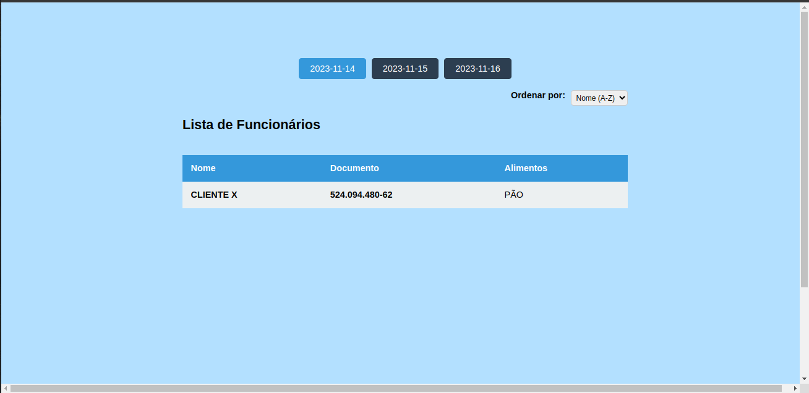
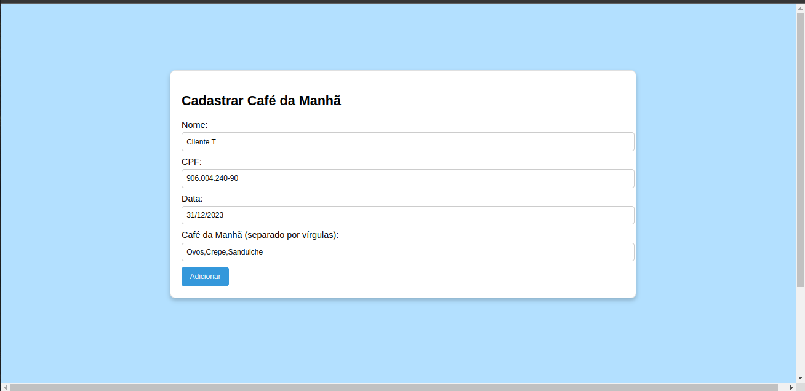

# Projeto BreakFast API (SpringBoot + React.js)

## Descrição
O Breakfast Project é um sistema para o cadastro de café da manhã, projetado para facilitar a organização e diversidade nas escolhas dos alimentos. A ideia é que cada funcionário possa registrar o que irá levar para o café da manhã em um determinado dia. As principais informações a serem preenchidas são:

- Nome do Funcionário
- CPF do Funcionário
- Data do Café da Manhã
- Alimento que o Funcionário irá levar

Regras do Sistema:

1. Cada funcionário pode levar mais de um alimento por dia.
2. Cada dia, somente uma pessoa pode levar cada tipo de alimento (evitando repetições).
3. Garante-se a diversidade de alimentos, proporcionando uma variedade agradável no café da manhã da equipe.

### Como Executar usando Docker

1. **Clonar repositório git**
2. **Construir o projeto:**
   ```bash
  ./mvnw clean package
   
2. **Construir a imagem:**
    ```bash
    ./mvnw spring-boot:build-image
    
3. **Executar o container:**
    ```bash
    docker run --name breakfast -p 8080:8080  -d breakfast:0.0.1-SNAPSHOT
    
A API poderá ser acessada em localhost:8080.

## Configuração do Frontend (React)
1. **Navegue até o diretório do frontend:**
   ```bash
   cd multisteps-project/frontend
   
2. **Instale as dependências:**
    ```bash
    npm install
    
3. **Inicie o aplicativo React:**
    ```bash
    npm dev
    
O aplicativo estará disponível em http://localhost:5173.

## **Etapas Front-end📋**
1 - Tela Inicial


2 - Tela de Cadastro


## Tecnologias Utilizadas

### Backend (Java/Spring Boot)
- [Java](https://www.java.com/)
- [Spring Boot](https://spring.io/projects/spring-boot)
- [Hibernate](https://hibernate.org/)
- [H2 Database](https://www.h2database.com/)

### Frontend (React)
- [React.js](https://reactjs.org/) - Biblioteca JavaScript para construção de interfaces de usuário.
- [React Router Dom](https://reactrouter.com/web/guides/quick-start) - Roteamento para aplicativos React.
- [Axios](https://axios-http.com/) - Cliente HTTP para fazer requisições HTTP.


## Contribuição
Contribuições são bem-vindas! Sinta-se à vontade para abrir problemas ou enviar pull requests.

## Contato
Caso tenham duvida ou identifiquem algum erro, meu LinkedIn (https://www.linkedin.com/in/yuri-travassos/)